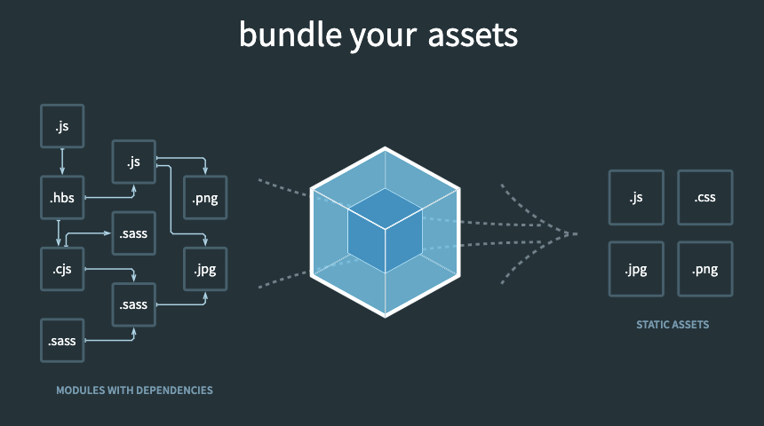
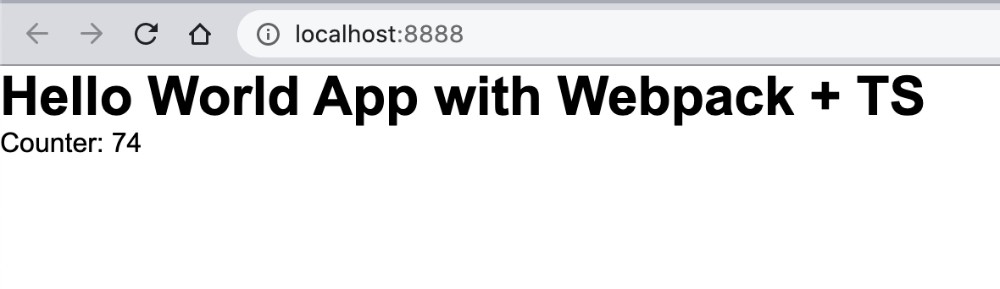

# Web Bundlers: Webpack

Los web bundlers se encargan de la gestión de dependencias de nuestros proyectos, la compresión y la generación de paquetes de código listo para producción, entre otras cosas. Para nuestro caso actual nos centraremos en estudiar [**Webpack**](https://webpack.js.org/), aunque no dejen de revisar otros empaquetadores como:

*  [**Browserify**]([Browserify](http://browserify.org/))
* [**Brunch**](http://brunch.io/)
* [**Rollup**](https://www.npmjs.com/package/rollup)
* [**Parcel**](https://parceljs.org/)

##WebPack



Webpack es básicamente un empaquetador de módulos estáticos para aplicaciones en JavaScript. Cuando webpack compila una aplicación internamente genera un grafo de dependencias que mapeará todos los módulos que el proyecto requiere y generará los paquetes asociados al mismo, de hecho webpack nos permite trabajar el concepto de Javascript modular como se presenta en NodeJS pues el mismo se encargará de transpilar nuestro desarrollo a una versión compatible para los navegadores y además desde la versión *4.0.0* ya no es necesario un archivo de configuración base para poder realizar el empaquetado, aunque esto no descarta la posibilidad de poder crear uno.

### Tecnologías a destacar para usar con Webpack

* **[Sass](https://sass-lang.com/)**
* **[TypeScript](https://www.typescriptlang.org/)**
* **[ES6+](http://es6-features.org/#Constants) ([ES7 - ES8](https://node.university/blog/7297/es7-es8-post))**
* **[Handlebars](https://handlebarsjs.com/)**

## Conceptos de WebPack

### [Entry](https://webpack.js.org/concepts/#entry)

El Entry, entry point o punto de entrada es quien define la ubicación del archivo principal desde el ccual se hará el proceso de empaquetado de la aplicación, de esta manera todo lo que sea una dependencia de este archivo será adicionado al archivo resultante del bundle. 

Piensen en el entry point como la lista de invitados a la fiesta, el que no está allí referenciado no puede entrar.

### [Loaders](https://webpack.js.org/concepts/loaders/)

De entrada Webpack sólo sabe leer importaciones de JavaScript o JSON, pero no es lo único que podríamos cargar, de hecho podemos importar dentro de nuestro archivo principal hojas de estilo, imagenes y más, pero para todo ello requerimos de enseñarle a webpack cómo se cargan estos archivos y allí entran los Loaders.

A continuación algunos cargadores muy útiles:

* SVG: `npm i svg-inline-loader --save-dev`
* SASS: `npm install sass-loader sass webpack --save-dev`
* HTML: `npm install --save-dev html-loader`
* Style Loader: `npm i style-loader --save-dev`

Y todos los demás [acá](https://webpack.js.org/loaders/)

### [Plugins](https://webpack.js.org/concepts/plugins/)

Los plugins permiten realizar tareas complejas como la optimización del emapquetado, la inyección de variables de entorno, la gestión de los assets del proeycto, entre otras. Todas la acciones de los plugins se llevan a cabo después de que el Bundle fue creado, a diferencia de los cargadores que se utilizan antes o durante la creación del bundle.

Un ejemplo de plugin podría ser el **HtmlWebpackPlugin**, quien se encarga de generar el archivo índex.html por nosotros y adiciona el bundle principal de la carpeta **dist** (nombre por defecto de la carpeta de contenido generado al hacer el bumdle).

###[Output](https://webpack.js.org/concepts/output/)

El Output nos define la ubicación de salida y el nombre del archivo final para producción de nuestra aplicación.

### Otros conceptos

Existen otros conceptos relevantes en un nivel un poco más avanzado, estos los podrás encontrar acá:

* **[Mode](https://webpack.js.org/concepts/#mode)**

* **[Browser Compatibility](https://webpack.js.org/concepts/#browser-compatibility)**

* [**Environment**](https://webpack.js.org/concepts/#environment)

  

## Creando un proyecto con Webpack

Vamos a crearnos un nuevo proyecto que tendrá webpack con configuraciones para TypeScript, Pass y Handlebars, además claro de poder soportar ES6+.

Primero crearemos un directorio para ello:

```bash
mkdir helloWebPack
cd helloWebPack
npm init -y # el flag -y nos permite saltarnos las preguntas de configuración
npm install webpack webpack-cli --save-dev # instalamos como dependencias de desarollo en el proyecto a webpack y sy cli
npm i --save lodash
```

Una vez instalado todo crearemos la estructura básica del proyecto

```bash
touch index.html
mkdir src
touch src/index.js
```

Y adicionaremos a estos archivo el siguiente código:

**src/index.js**

```javascript
// cargamos lodash, por defecto los elementos a importar sin ruta serán buscados en los módulos de node
import _ from 'lodash';

function component() {
  const element = document.createElement('div');

  // el caractér _ hace referencia a una biblioteca llamada lodash que será muy útil
  element.innerHTML = _.join(['Hello', 'webpack'], ' ');

  return element;
}

document.body.appendChild(component());
```

**index.html**

```html
<!doctype html>
<html>
  <head>
    <title>Hola Webpack</title>
  </head>
  <body>
    <script src="./src/index.js"></script>
  </body>
</html>
```

Ahora adicionaremos un script para compilar nuestro proyecto dentro del **package.json**

```JSON
{
  "name": "helloWebPack",
  "version": "1.0.0",
  "description": "",
  "main": "index.js",
  "scripts": {
    "build": "webpack",
    "test": "echo \"Error: no test specified\" && exit 1"
  },
  "keywords": [],
  "author": "",
  "license": "ISC",
  "devDependencies": {
    "webpack": "^4.44.1",
    "webpack-cli": "^3.3.12"
  }
}
```

Y ahora podremos crear nuestro primer Build corriendo el comando a continuación en la terminal:

```bash
npm run build
```

Esto generará una carpeta dist con el bundle adentro que por defecto se llama **main.js**, ahora podríamos usar ese bundle en nuestro archivo índex.html para correr el proyecto:

```html
<!doctype html>
<html>
  <head>
    <title>Hola Webpack</title>
  </head>
  <body>
    <script src="./dist/main.js"></script>
  </body>
</html>

```

### Un poco más de nivel

Ahora probemos importar fragmentos de scripts y ver cómo se comporta la compilación del paquete. Crearemos un archivo llamado **maths.js** que expondrá ciertos métodos matemáticos:

**maths.js**

```js
export function sum(a, b) {
    return a + b;
}

export function subs(a, b) {
    return a - b;
}

export function mult(a, b) {
    return a * b;
}
```

y modificaremos nuestro **index.js** para importar sólo la función **sum** y usarla.

**index.js**

```js
// cargamos lodash, por defecto los elementos a importar sin ruta serán buscados en los módulos de node
import _ from 'lodash';

import {sum} from './maths'

function component() {
  const element = document.createElement('div');

  // el caractér _ hace referencia a una biblioteca llamada lodash que será muy útil
    element.innerHTML = _.join(['Hello', 'webpack'], ' ');
    element.innerHTML += ` Sum of 4 + 5 = ${sum(4, 5)}`;

  return element;
}

document.body.appendChild(component());
```


## Configurando WebPack

Crearemos un archivo de configuración de Webpack usando el siguiente nombre: **webpack.config.js**

```js
const path = require('path');

module.exports = {
  entry: './src/index.js',
  output: {
    filename: 'main.js',
    path: path.resolve(__dirname, 'dist'),
  },
};
```

### [Instalando transpiladores](https://webpack.js.org/loaders/#transpiling)

Para poder usar las nuevas funcionalidades de ES6 en todos lados y gemas como typescript es necesario que en nuestro archivo de configuración adicionemos transpiladores, empezaremos con [Babel](https://webpack.js.org/loaders/babel-loader/).

Ahora que lo hemos logrado pasaremos a instalar [TypeScript](https://webpack.js.org/guides/typescript/).

Y por último trabajaremos con [SASS](https://webpack.js.org/loaders/sass-loader/)

### ¿Cansados de estar compilando? Webpack DevServer

Con webpacl devserver vamos a poder estar desarrollando cargando nuestra compilación en memoria sin estar generando constantemente un build ni refrescando.

Documentación [acá](https://webpack.js.org/configuration/dev-server/)

### Nuestro primer Plugin: Handlebars

Con Handlebars vamos a poder realizar interpolaciones rápidas en nuestros documentos para reemplazar los valores renderizados con los valores de nuestra lógica.

[Plugin](https://www.npmjs.com/package/handlebars-webpack-plugin).


**Nota:** Para el correcto funcionamiento fue necesario realizar la instalación de las siguientes dependencias

* npm install --save-dev @types/lodash
* npm i awesome-typescript-loader --save-dev
* npm i @types/source-map@0.5.2 --save-dev

ts-loader no funciona adecuadamente con el HTMLWebpacPlugin y por eso se reemplaza por awesome-typescript-loader


# Estructurando una aplicación a nivel empresarial

Usaremos como referencia el arquetipo planteado por Angular para que nuestro proyecto tenga el siguiente esquema:

```
	|-- src                        |=>| Carpeta principal del código del proyecto
	|---- app                			 |=>| Carpeta principal del código de la aplicación web 
	|-------- components           |=>| Carpeta contenedora de componentes web
	|-------- interfaces           |=>| Carpeta contenedora de interfaces
	|-------- models               |=>| Carpeta contenedora de modelos y DTOs
	|-------- pages                |=>| Carpeta contenedora de páginas (también puede llamarse views)
	|-------- app.ts               |=>| Archivo principal de la aplicación importado por el entry point
	|---- assets                   |=>| Assets del proyecto
	|---- environments             |=>| Carpeta de archivos de configuración de entornos
	|---- fonts                 	 |=>| Carpeta de fuentes			
	|---- main.ts									 |=>| Archivo principal (EntryPoint)
	|---- styles.scss					  	 |=>| Hoja de estilos principal, dentro de esta se pueden importar las demás
```

Podemos realizar esto con el comando:

```bash
mkdir -p src/app/components
mkdir -p src/app/interfaces
mkdir -p src/app/models
mkdir -p src/app/pages
mkdir -p src/assets
mkdir -p src/environments
mkdir -p src/fonts
touch src/app/app.ts
touch src/main.ts
touch src/styles.scss
```

Ahora modificaremos nuestro archivo **app.ts** para convertirlo en un módulo que será importado en **main.ts**

```typescript
import { count } from './counter'

class App {

  render() {
    const component = this.component();
    component.innerHTML = "<h1>Hello World App with Webpack + TS</h1> <p>Counter: <span></span></p>";
    window.setInterval(() => { count(component.querySelector("p span")) }, 1000);
    document.body.append(component);
  }

  component() {
    const element = document.createElement('div');
    element.id = "app";
    return element;
  }
}

const app = new App();
app.render();
```

Así mismo modificaremos **main.ts**:

```typescript
require('./app/app')
```

Y por último cambiaremos en nuestro **webpack.config.js** el entrypoint a main.ts

```js
...
module.exports = {
    entry: './src/main.ts',
...
```

Ahora ya tenemos casi todo lo básico para iniciar, vamos a tomar un par de pasos adicionales.

## Configurando la carga de archivos HTML y Hojas de estilo

Vamos primero a adicionar el cargador de SASS (que ya deberían tener claramente):

```bash
npm install css-loader style-loader  sass-loader sass webpack --save-dev
```

Adicionaremos la regla de a nuestro webpack config.

```js
...
module: {
  	rules: [
      	{
            test: /\.s[ac]ss$/i,
            use: [
              // Creates `style` nodes from JS strings
              'style-loader',
              // Translates CSS into CommonJS
              'css-loader',
              // Compiles Sass to CSS
              'sass-loader',
                ],
        },
    ]
}
...
```

Y ahora importaremos nuestro **styles.scss** al entry point, esta será nuestra hoja de estilos global, pero cada componente o page podrá tener su propia hoja independiente.

Así se vería nuestro **styles.scss**:

```sass
*{
    box-sizing: border-box;
    padding: 0;
    margin: 0;
}

body{
    font-family: Arial, Helvetica, sans-serif;
    width: 100vw;
    height: 100vh;
}
```

y así el **main.ts**:

```typescript
require('./app/app')

import './styles.scss';

```

Y ahora mismo nuestra App se vería así:



## Es momento de cargar archivos HTML

Y para ello usaremos el [HTML Loader](https://webpack.js.org/loaders/html-loader/)

```bash
npm install --save-dev html-loader
```

y lo de siempre en nuestra configuración de WebPack:

```js
module.exports = {
  module: {
    rules: [
      {
        test: /\.html$/i,
        loader: 'html-loader',
      },
    ],
  },
};
```

Ahora provemos creando nuestra primera Page, para esto crearemos una carpta **Home** dentro de pages y adentro crearemos nuestra vista: **HomePage.html**.

```html

<h1>Hello World App with Webpack + TS</h1> 
<p>Counter: <span></span></p>

```

Recordemos que como vamos a insertar elementos dentro de un solo archivo global nuestras pages serán más bien fragmentos y de hecho los utilizaremos como [DocumentFragments](https://developer.mozilla.org/es/docs/Web/API/DocumentFragment). Ahora a cada vista le debemos asignar un controlador, el cual será encargado de toda la lógica de la vista, además será quien estará importado en el App.

Ahora crearemos nuestro controlador **HomePageController.ts** dentro src/app/pages/Home

```typescript
const view = require('./HomePage.html');
import { count } from '../../counter';

export class HomePageController {

    view = view;
    viewId: string = "home"

    constructor() { 
        this.startTimer();
    }
    
    getView(): [string, DocumentFragment] {
        return [this.viewId, document.createRange().createContextualFragment(view)];
    }

    startTimer() {
        window.setInterval(() => { count(document.querySelector(`#${this.viewId} p span`)) }, 1000);
    }
}
```

Hemos creado nuestro controlador y así mismo le hemos asignado una vista al mismo, además de crear un método para poder retornar esa vista a la aplicación para renderisarla, es hora de modificar nuestro **main.ts**:

```typescript
import { count } from './counter'
import { HomePageController } from './pages/Home/HomePageController'
class App {
  
  mainPages = [
    HomePageController
  ];

  render() {
    const component = this.component();
    this.mainPages.forEach(pageController => {
      const [elId, element] = new HomePageController().getView();
      component.appendChild(this.createPage(elId, element));
    })
    
    document.body.append(component);
  }

  createPage(id: string, element: DocumentFragment) {
    const page = document.createElement('div');
    page.id = id;
    page.appendChild(element);
    return page;
  }

  component() {
    const element = document.createElement('div');
    element.id = "app";
    return element;
  }
}

const app = new App();
app.render();
```

Ahora en lugar de renderizar un elemento estático, usaremos todos los elementos registrados como **mainPages** para crear elementos únicos para cada uno dentro de la aplicación.

**Nota:** Si creamos una clase Controller maestra que tenga estos métodos comúnes podremos heredarlas y tener código más limpio, pero eso es algo que ustedes mismo deberán hacer por ahora para practicar **POO**.

Ahora sólo queda un reto, y es cargar las hojas de estilo para cada page, pronto trabajaremos con [**WebComponents**](https://developer.mozilla.org/es/docs/Web/Web_Components) y podrémos hacer más hermético aún nuestro desarrollo.

